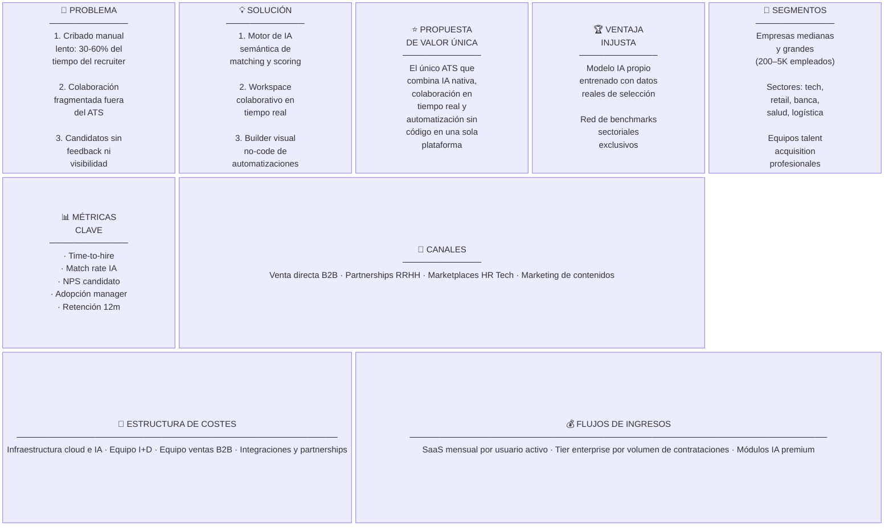
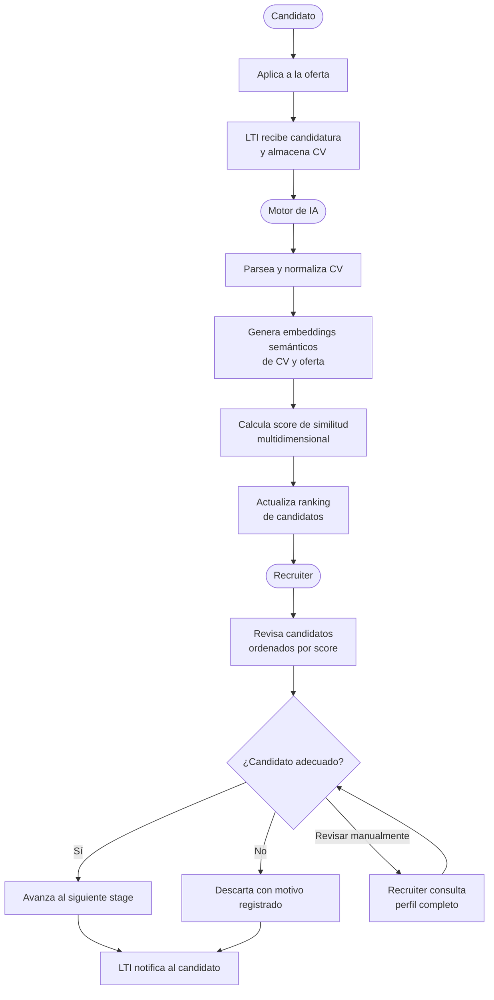
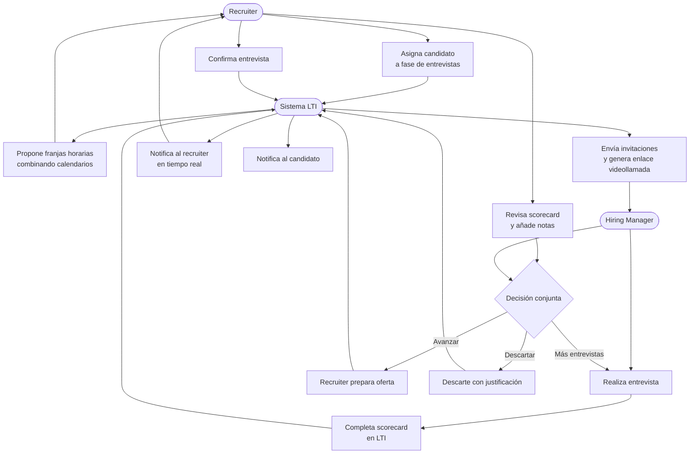
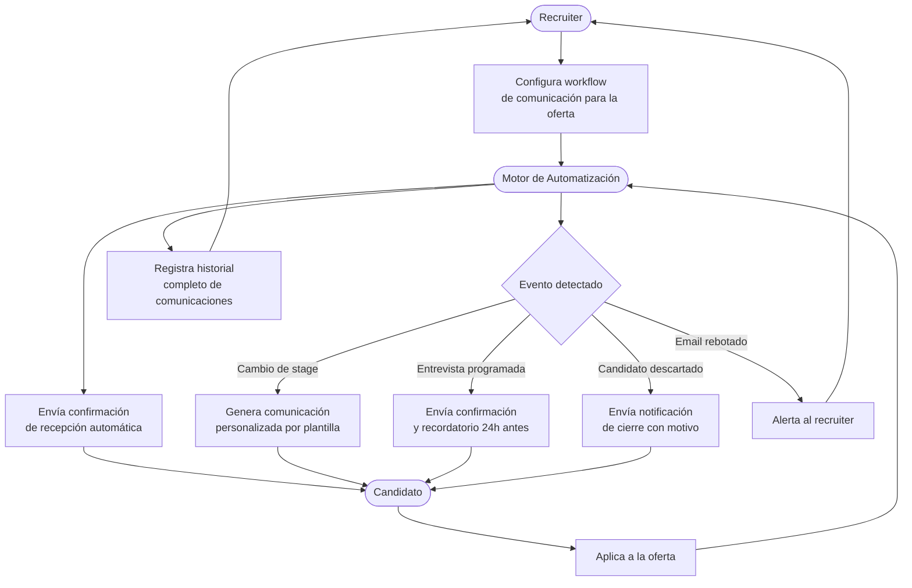
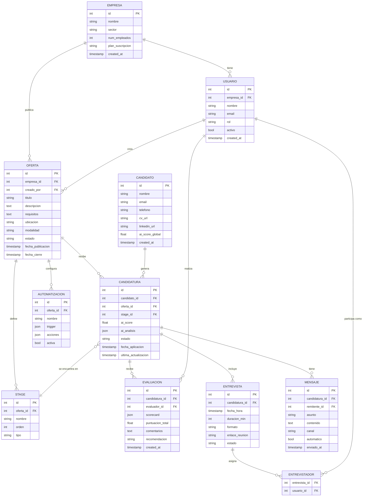
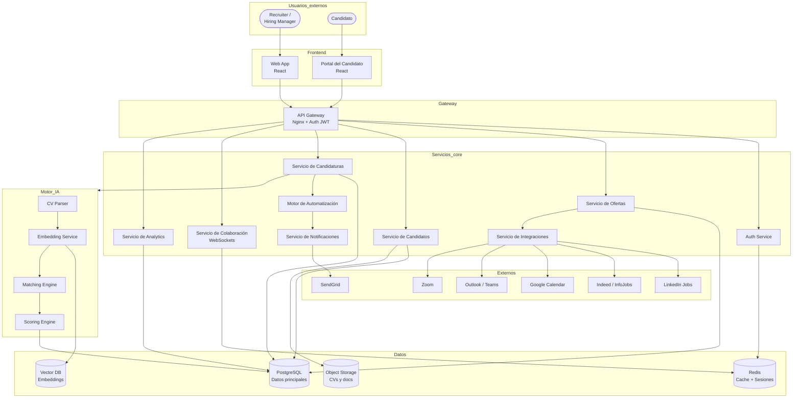
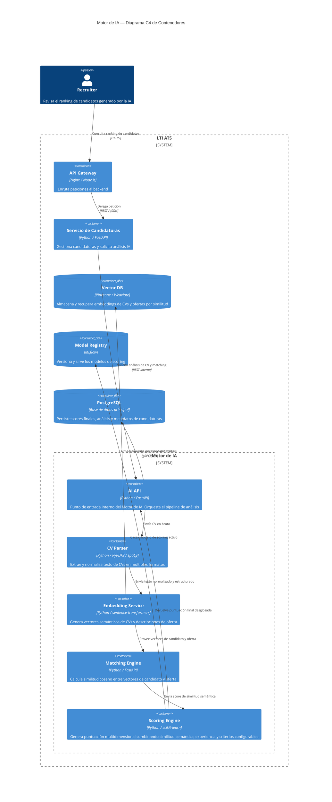
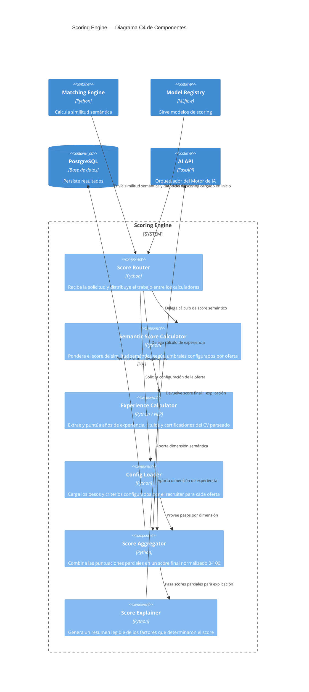

# LTI — Sistema ATS del Futuro

---

## 1. Descripción del software LTI

LTI es un **ATS (Applicant Tracking System) de nueva generación** diseñado para medianas y grandes empresas con procesos de selección de alto volumen. A diferencia de los ATS tradicionales, LTI integra **IA semántica nativa**, **colaboración en tiempo real** entre recruiters y hiring managers, y **automatización sin código** de los flujos de selección, todo en una única plataforma. Su objetivo es eliminar el trabajo administrativo repetitivo, reducir el tiempo de cobertura de posiciones y convertir el proceso de selección en una experiencia ágil, colaborativa y basada en datos.

### Valor añadido y ventajas competitivas

Los ATS actuales (Greenhouse, Lever, Workday Recruiting) presentan limitaciones estructurales que LTI resuelve:

| Limitación actual | Respuesta de LTI |
|---|---|
| Cribado manual lento (revisión CV a CV) | Motor de matching semántico con IA que rankea y puntúa candidatos automáticamente |
| Colaboración fragmentada (emails, Excel, notas fuera del sistema) | Workspace colaborativo en tiempo real donde recruiters y managers trabajan juntos sobre el mismo pipeline |
| Automatizaciones rígidas o inexistentes | Builder visual no-code para crear workflows de selección personalizados sin programar |
| Experiencia del candidato deficiente (silencio tras aplicar) | Portal del candidato con actualizaciones automáticas en cada cambio de estado |
| Analytics poco accionable | Reporting predictivo: tiempo de cobertura estimado, calidad de contratación por fuente, ROI por canal |

---

## 2. Funciones principales

1. **Motor de IA semántica** — Analiza CVs y descripciones de puesto mediante embeddings para generar un ranking automático de candidatos con puntuación multidimensional (fit técnico, cultural, experiencia). No depende de keywords, entiende el significado.

2. **Pipeline colaborativo en tiempo real** — Kanban visual del proceso de selección accesible simultáneamente por recruiters y hiring managers. Cambios, comentarios y evaluaciones visibles al instante sin recargar la página.

3. **Automatización no-code de flujos** — Builder visual para crear reglas y secuencias automáticas: correos de confirmación, recordatorios de entrevista, notificaciones por cambio de stage, descarte automatizado por criterios definidos.

4. **Publicación multicanal de ofertas** — Publica simultáneamente en LinkedIn, Indeed, InfoJobs y la página de empleo propia con un solo clic. Gestiona todas las candidaturas entrantes en un único buzón centralizado.

5. **Scorecard colaborativo de evaluación** — Plantillas de evaluación estructurada por rol. Cada entrevistador completa su valoración de forma independiente; LTI agrega los resultados y facilita la toma de decisión conjunta.

6. **Portal del candidato** — Acceso personalizado para candidatos donde pueden consultar el estado de su candidatura, confirmar entrevistas y recibir comunicaciones. Reduce el silencio y mejora la experiencia.

7. **Programación inteligente de entrevistas** — Sincronización con Google Calendar y Outlook. Propone franjas horarias comunes entre entrevistadores y candidato, genera enlaces de videoconferencia automáticamente (Zoom, Teams).

8. **Analytics y reporting predictivo** — Dashboards con métricas de proceso (time-to-hire, conversion rates por stage) y métricas de calidad (retención a 6 y 12 meses por fuente, eficacia del matching IA).

9. **Cumplimiento legal integrado** — Gestión de consentimientos GDPR, anonimización de datos para evaluación ciega, trazabilidad completa de decisiones para auditorías EEOC.

---

## 3. Lean Canvas

> Diagrama generado con Mermaid `block-beta` (requiere Mermaid v11+). Para previsualizar: [mermaid.live](https://mermaid.live)

---

## 4. Casos de uso principales

### Caso de uso 1: Cribado y preselección automática con IA

**Actores:** Recruiter, Motor de IA, Candidato.

**Descripción:** Una vez publicada una oferta, los candidatos aplican y el motor de IA de LTI analiza automáticamente cada CV comparándolo semánticamente con los requisitos del puesto. Genera un ranking con puntuación multidimensional, permitiendo al recruiter concentrar su tiempo en revisar únicamente los candidatos con mayor fit.

**Flujo principal:**
1. El recruiter publica una oferta con descripción de puesto y requisitos mínimos y deseables.
2. Los candidatos aplican a través del portal o fuentes externas (LinkedIn, Indeed).
3. El Motor de IA recibe cada candidatura, parsea el CV y genera embeddings semánticos.
4. El Motor de IA calcula el score de similitud entre el perfil del candidato y la oferta.
5. LTI genera un ranking ordenado de candidatos con puntuación desglosada (fit técnico, experiencia, fit cultural estimado).
6. El recruiter accede al pipeline y revisa los candidatos ordenados por score.
7. El recruiter avanza a los candidatos seleccionados al siguiente stage o los descarta con un motivo registrado.
8. El sistema notifica automáticamente al candidato sobre el cambio de estado.

**Flujos alternativos:**
- Si el CV no es parseable (imagen, formato no estándar), el sistema notifica al recruiter para revisión manual.
- El recruiter puede ajustar el peso de los criterios de scoring (priorizar experiencia sobre formación, por ejemplo) sin reentrenar el modelo.
- Si ningún candidato supera un umbral mínimo de score, LTI alerta al recruiter para revisar la descripción de la oferta.

---

### Caso de uso 2: Evaluación colaborativa recruiter-manager

**Actores:** Recruiter, Hiring Manager, Sistema LTI.

**Descripción:** Una vez que un candidato ha superado el cribado inicial, el recruiter y el hiring manager colaboran en tiempo real dentro de LTI para coordinar entrevistas, completar scorecards y tomar la decisión de contratación de forma conjunta, sin salir del sistema.

**Flujo principal:**
1. El recruiter selecciona al candidato y lo asigna a la fase de entrevistas.
2. LTI propone franjas horarias disponibles combinando los calendarios del hiring manager, el recruiter y el candidato.
3. El recruiter confirma la entrevista; LTI genera el enlace de videoconferencia y envía invitaciones.
4. El hiring manager realiza la entrevista y completa el scorecard estructurado en LTI durante o después de la misma.
5. El recruiter recibe la evaluación en tiempo real y puede añadir sus propias notas.
6. Ambos pueden comentar y discutir el perfil del candidato directamente en el workspace colaborativo de LTI.
7. Se toma una decisión conjunta: avanzar a oferta, programar otra entrevista o descartar.
8. LTI registra la decisión y notifica automáticamente al candidato.

**Flujos alternativos:**
- Si el hiring manager no completa el scorecard en el plazo definido, LTI envía un recordatorio automático.
- El recruiter puede invitar a entrevistadores adicionales (p.ej. un tech lead) que completan su propio scorecard.
- Si hay desacuerdo entre evaluaciones, LTI muestra las divergencias de forma visual para facilitar la discusión.

---

### Caso de uso 3: Automatización del ciclo de comunicación con el candidato

**Actores:** Recruiter, Motor de Automatización, Candidato.

**Descripción:** El recruiter configura una vez el flujo de comunicación para una oferta. A partir de ese momento, LTI gestiona automáticamente todas las comunicaciones con el candidato en cada etapa del proceso: confirmaciones, actualizaciones de estado, recordatorios de entrevista y notificaciones de cierre, sin intervención manual del recruiter.

**Flujo principal:**
1. El recruiter accede al builder de automatizaciones y define el workflow para la oferta.
2. Para cada stage, configura: qué mensaje se envía, cuándo y con qué plantilla.
3. El candidato aplica a la oferta y recibe automáticamente un email de confirmación de recepción.
4. Al avanzar de stage, LTI detecta el cambio y dispara la comunicación correspondiente configurada.
5. Si se programa una entrevista, el sistema envía confirmación con enlace y recordatorio 24h antes.
6. Si el candidato es descartado, LTI envía una notificación de cierre personalizada.
7. El recruiter puede consultar en cualquier momento el historial completo de comunicaciones de cada candidato.

**Flujos alternativos:**
- El recruiter puede enviar mensajes manuales en cualquier momento fuera del flujo automático.
- Si un email rebota, LTI notifica al recruiter para que verifique los datos de contacto.
- Los candidatos pueden responder a los emails; las respuestas llegan al buzón del recruiter dentro de LTI.

---

## 5. Modelo de datos

### Entidades principales

**Empresa** — Organización cliente que usa LTI. Agrupa a todos sus usuarios y ofertas bajo un mismo tenant.

**Usuario** — Persona que opera en LTI: recruiter, hiring manager o administrador. Pertenece a una empresa.

**Oferta** — Posición abierta publicada por una empresa. Contiene la descripción, requisitos y el pipeline de stages asociado.

**Stage** — Etapa del pipeline de selección de una oferta (p.ej. "Aplicación recibida", "Cribado IA", "Entrevista técnica", "Oferta"). Las etapas son configurables por oferta.

**Candidato** — Persona externa que aplica a ofertas. Sus datos y CV son reutilizados si aplica a varias posiciones.

**Candidatura** — Relación entre un candidato y una oferta. Contiene el estado en el pipeline, el score IA y el historial de movimientos.

**Evaluación** — Scorecard completado por un usuario (entrevistador) sobre una candidatura concreta.

**Entrevista** — Encuentro programado entre uno o varios usuarios y un candidato, vinculado a una candidatura.

**Automatización** — Regla configurada por el recruiter que define disparadores (triggers) y acciones automáticas para una oferta.

**Mensaje** — Comunicación enviada a un candidato, ya sea automática (por automatización) o manual (por el recruiter).

### Diagrama entidad-relación

---

## 6. Diseño del sistema a alto nivel

### Patrón arquitectónico

LTI adopta una **arquitectura de microservicios** organizada en torno a los dominios funcionales del sistema. Esta elección responde a tres requisitos clave:

- **Escalabilidad independiente**: el Motor de IA tiene picos de carga distintos a los del servicio de notificaciones. Con microservicios, cada dominio escala según su propia demanda sin sobredimensionar el sistema completo.
- **Colaboración en tiempo real**: el Servicio de Colaboración requiere conexiones persistentes (WebSockets) con latencia ultrabaja, lo que justifica aislarlo del resto de servicios síncronos.
- **Evolución del módulo de IA**: los modelos de embedding y scoring necesitan actualizarse con frecuencia y de forma independiente al ciclo de despliegue del resto de la plataforma.

### Componentes principales

| Componente | Responsabilidad |
|---|---|
| **Web App (React)** | Interfaz principal para recruiters y hiring managers. Consume la API Gateway. |
| **Portal del Candidato (React)** | Interfaz pública para candidatos. Acceso restringido por token único por candidatura. |
| **API Gateway** | Punto único de entrada. Enruta peticiones, aplica rate limiting y autenticación JWT. |
| **Servicio de Autenticación** | Registro, login, gestión de sesiones y permisos por rol. |
| **Servicio de Ofertas** | CRUD de ofertas, gestión del pipeline de stages, publicación multicanal. |
| **Servicio de Candidatos** | Gestión de perfiles de candidatos y almacenamiento de CVs. |
| **Servicio de Candidaturas** | Gestión del ciclo de vida de cada candidatura: movimientos de stage, historial, evaluaciones. |
| **Motor de IA** | Parsing de CVs, generación de embeddings, matching semántico y scoring. Expone API REST interna. |
| **Servicio de Colaboración** | Comunicación en tiempo real vía WebSockets. Sincroniza el pipeline entre usuarios conectados. |
| **Motor de Automatización** | Evalúa triggers y ejecuta acciones automáticas (emails, cambios de stage, notificaciones). |
| **Servicio de Notificaciones** | Envío de emails y notificaciones in-app. Integra con SendGrid. |
| **Servicio de Integraciones** | Conectores con LinkedIn Jobs, Indeed, Google Calendar, Outlook, Zoom y Teams. |
| **Servicio de Analytics** | Agrega métricas del proceso y genera reportes bajo demanda. |

### Integraciones externas

- **Portales de empleo**: LinkedIn Jobs API, Indeed Publisher, InfoJobs.
- **Calendarios**: Google Calendar API, Microsoft Graph API (Outlook/Teams).
- **Videoconferencia**: Zoom API, Microsoft Teams.
- **Email**: SendGrid (transaccional y secuencias automatizadas).
- **Almacenamiento**: AWS S3 o equivalente para CVs y documentos adjuntos.

### Diagrama de arquitectura

---

## 7. Diagrama C4 — Motor de IA

El **Motor de IA** es el componente más diferencial de LTI. Es el responsable de transformar CVs en texto estructurado, generar representaciones vectoriales de candidatos y ofertas, calcular la similitud semántica entre ambos y producir una puntuación multidimensional que permite al recruiter priorizar su tiempo. Su arquitectura interna merece un análisis en profundidad.

### C4 Nivel Contenedor — Motor de IA

### C4 Nivel Componente — Scoring Engine

El **Scoring Engine** transforma la similitud semántica bruta en una puntuación accionable para el recruiter. Integra múltiples señales y permite configurar el peso de cada dimensión por oferta.

